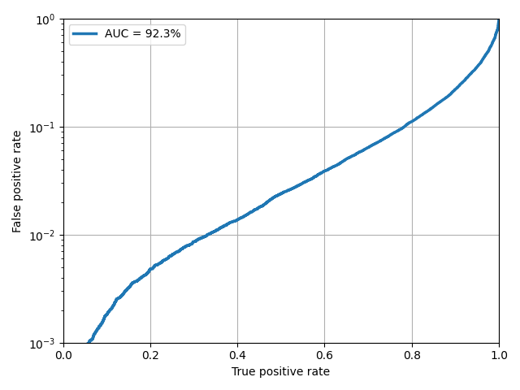

# Higgs boson observed decaying to b quarks

Sample with jet, track and secondary vertex properties for Hbb tagging. 
ML studies ased on sample are based on the simulated sample

- 'HiggsToBBNTuple_HiggsToBB_QCD_RunII_13TeV_MC'

## Description

The dataset consists of particle jets extracted from simulated proton-proton collision events at a center-of-mass energy of 13 TeV generated with Pythia 8. It has been produced for developing machine-learning algorithms to differentiate jets originating from a Higgs boson decaying to a bottom quark-antiquark pair (Hbb) from quark or gluon jets originating from quantum chromodynamic (QCD) multijet production.

The reconstructed jets are clustered using the anti-kT algorithm with R=0.8 from particle flow (PF) candidates (AK8 jets). The standard L1+L2+L3+residual jet energy corrections are applied to the jets and pileup contamination is mitigated using the charged hadron subtraction (CHS) algorithm. Features of the AK8 jets with transverse momentum pT > 200 GeV and pseudorapidity |η| < 2.4 are provided. Selected features of inclusive (both charged and neutral) PF candidates with pT > 0.95 GeV associated to the AK8 jet are provided. Additional features of charged PF candidates (formed primarily by a charged particle track) with pT > 0.95 GeV associated to the AK8 jet are also provided. Finally, additional features of reconstructed secondary vertices (SVs) associated to the AK8 jet (within ∆R < 0.8) are also provided.

https://opendata.cern.ch/record/12102#

## AUC Curves

