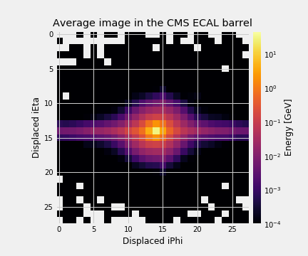
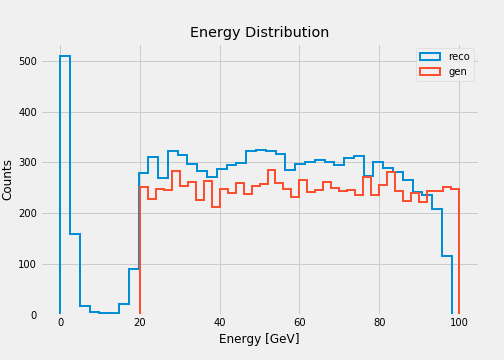
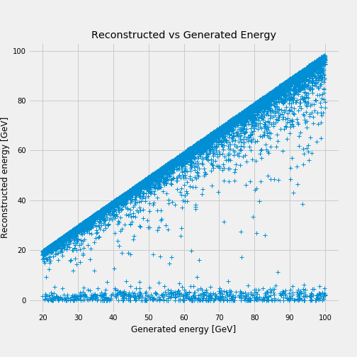
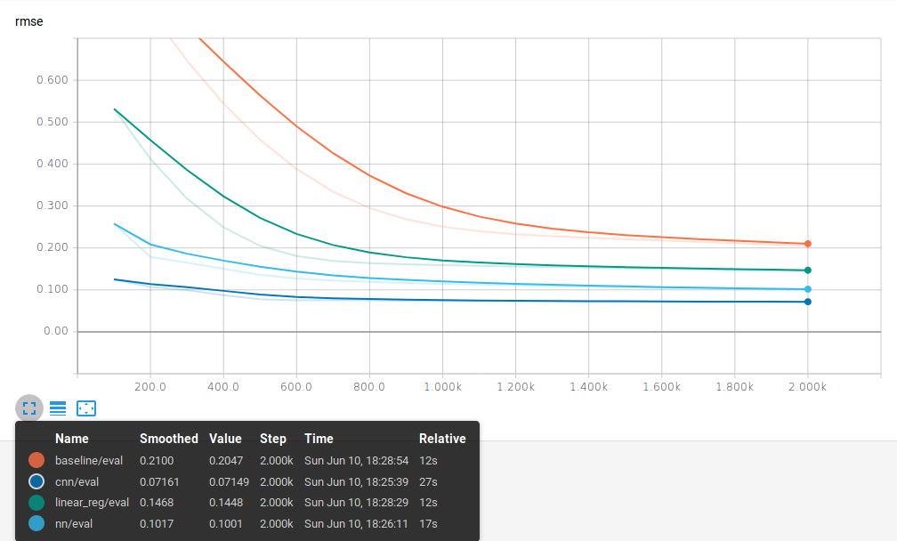
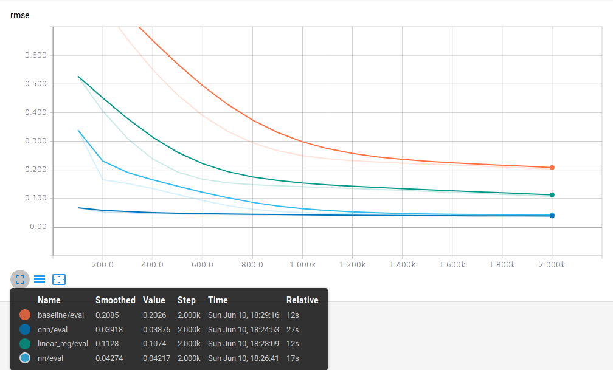
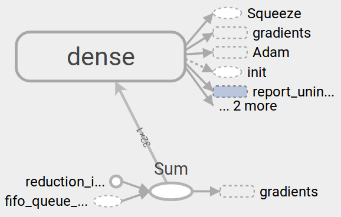
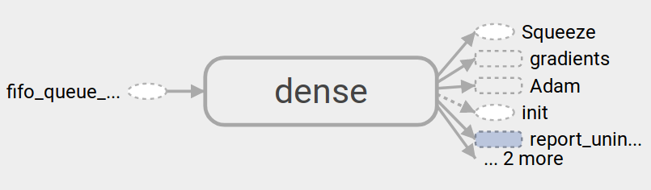
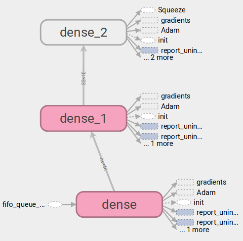
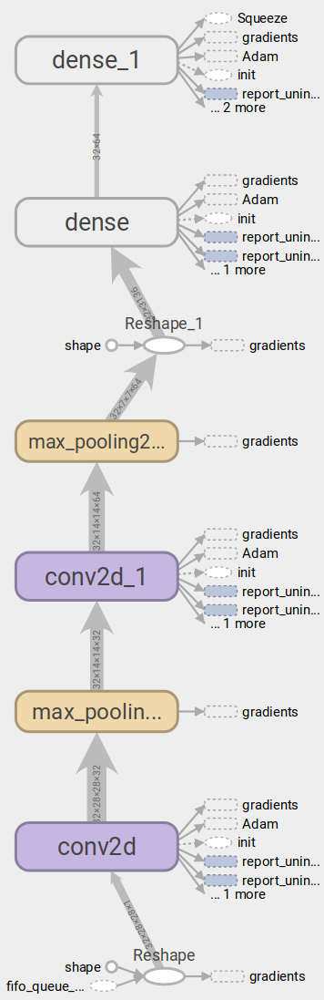

# Energy Regression

The goal is to train a regression model that minimizes the experimental error
associated with the energy reconstruction in the CMS electromagnetic calorimeter.

The results are based on the simulated sample

- `eplus_Ele-Eta0PhiPiOver2-Energy20to100_V2.json`.

### Average image after preprocessing
Initially the sample consists of highly sparse images. Consequently, a preprocessing
step to find a bounding box of 28x28 around the cell of maximum energy is applied.

### Energy distribution
The energy distribution at generator level is uniform between 20-100 GeV.
The reconstructed energy follows the same distribution but two anomalies are present,
a peak close to 0 GeV and a drop approaching to 100 GeV.

### Reconstructed vs Generated Energy
The root mean squared error [RMSE](python/custom_estimator.py#L61) measures
the discrepancy between the reconstructed energy and the generated value.

## Machine Learning Models

<table>
  <tr>
    <th>Model</th>
    <th>Total Parameters</th>
  </tr>
  <tr>
    <td><a href="https://github.com/jruizvar/ml-physics/blob/regression/python/custom_models.py#L6-L17">Baseline</a></td>
    <td>2</td>
  </tr>
  <tr>
    <td><a href="https://github.com/jruizvar/ml-physics/blob/regression/python/custom_models.py#L20-L27">Linear reg.</a></td>
    <td>785</td>
  </tr>
  <tr>
    <td><a href="https://github.com/jruizvar/ml-physics/blob/regression/python/custom_models.py#L30-L45">Shallow NN</a></td>
    <td>7971</td>
  </tr>
  <tr>
    <td><a href="https://github.com/jruizvar/ml-physics/blob/regression/python/custom_models.py#L48-L79">Convolutional NN</a></td>
    <td>252929</td>
  </tr>
</table>

The good performance of the neural networks at minimizing the
[RMSE](python/custom_estimator.py#L61) is demonstrated below:

<table>
  <tr>
    <th colspan="6">RMSE results</th>
  </tr>
  <tr>
    <td>Model \ Energy threshold</td>
    <th>0 GeV</th>
    <th>10 GeV</th>
    <th>20 GeV</th>
  </tr>
  <tr>
    <td><a href="https://github.com/jruizvar/ml-physics/blob/regression/python/custom_models.py#L6-L17">Baseline</a></td>
    <td>0.205</td>
    <td>0.203</td>
    <td>0.201</td>
  </tr>
  <tr>
    <td><a href="https://github.com/jruizvar/ml-physics/blob/regression/python/custom_models.py#L20-L27">Linear reg.</a></td>
    <td>0.145</td>
    <td>0.107</td>
    <td>0.107</td>
  </tr>
  <tr>
    <td><a href="https://github.com/jruizvar/ml-physics/blob/regression/python/custom_models.py#L30-L45">Shallow NN</a></td>
    <td>0.100</td>
    <td>0.042</td>
    <td>0.038</td>
  </tr>
  <tr>
    <td><a href="https://github.com/jruizvar/ml-physics/blob/regression/python/custom_models.py#L48-L79">Convolutional NN</a></td>
    <td>0.071</td>
    <td>0.039</td>
    <td>0.034</td>
  </tr>
</table>

In all scenarios the convolutional neural network outperforms the other models.

## Learning Curves
The evolution of the [RMSE](python/custom_estimator.py#L61) is calculated for the validation sample.
The horizonal axis represents the number of [steps](python/custom_estimator.py#L87).
One epoch is equivalent to 100 steps, and the plot extends up to 20 epochs.

### Threshold at 0 GeV

### Threshold at 10 GeV

### Threshold at 20 GeV

## TensorBoard Graphs

### [Baseline](python/custom_models.py#L6-L17)

### [Linear reg.](python/custom_models.py#L20-L27)

### [Shallow NN](python/custom_models.py#L30-L45)

### [Convolutional NN](python/custom_models.py#L48-L79)

## Python Modules

### [custom_dataset.py](python/custom_dataset.py)
- Create a dataset of training and validation examples with simulations of the
CMS electromagnetic calorimeter.

### [custom_models.py](python/custom_models.py)
- Create models in [TensorFlow](https://www.tensorflow.org).

### [custom_estimator.py](python/custom_estimator.py)
- Build a regression model using
[tf.estimator](https://www.tensorflow.org/programmers_guide/estimators) API.

Examples of usage:
- `python custom_estimator.py --threshold 0. --model baseline`
- `python custom_estimator.py --threshold 0. --model linear_reg`
- `python custom_estimator.py --threshold 0. --model nn`
- `python custom_estimator.py --threshold 0. --model cnn`
